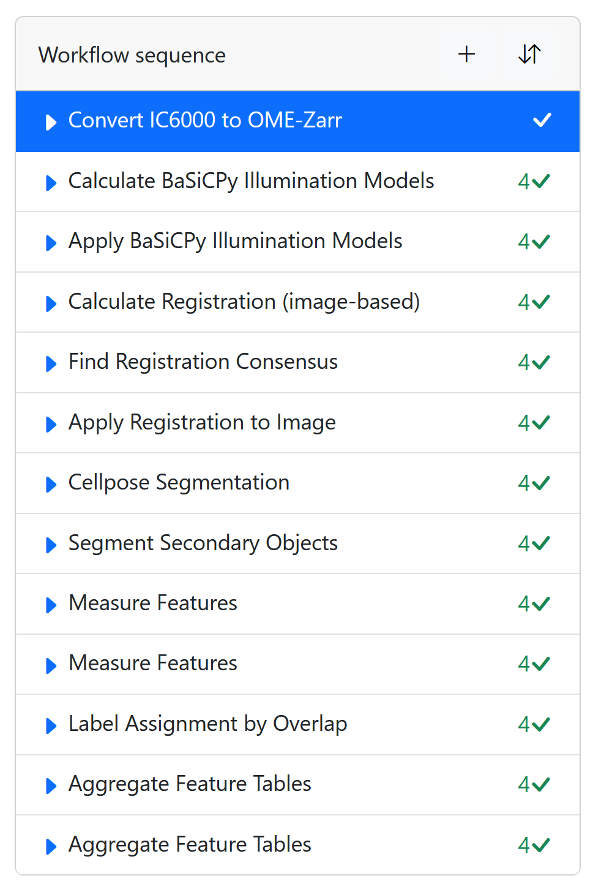

# Example Pipeline

An example pipeline for Fractal is provided in the `examples` directory of
the [APx Fractal Task Collection github repository](https://github.com/Apricot-Therapeutics/APx_fractal_task_collection).
The pipelines demonstrates
how the tasks in this collection can be used to process multiplexed 2D image data. The example covers a relatively
simple
pipeline that will convert images, perform some corrections, segment objects and then extract feature values. You can
use the data in the 'tests/data/IC6000' directory of the
repository to run the workflows. In the following sections, the single steps of the pipeline are described in detail.

<figure markdown="span">
    { style="height:600px; display: block; margin: 0 auto;" }
    <figcaption>Screenshot of an example pipeline on Fractal</figcaption>
</figure>

## OME-Zarr Conversion

The [`Convert IC6000 to OME-Zarr`][apx_fractal_task_collection.tasks.convert_IC6000_to_ome_zarr.convert_IC6000_to_ome_zarr]
task simply takes an output image directory from an InCell6000 microscope and converts them into a Fractal-compatible
OME-Zarr file. You can convert multiple cycles for multiplexed experiments or just a single cycle if the experiments is
a simple IF experiment.

## Illumination Correction

Once you converted some images to the OME-Zarr format, the next step often is to correct illumination artifacts.
The [`Calculate BaSiCPy Illumination Models`][apx_fractal_task_collection.tasks.calculate_basicpy_illumination_models.calculate_basicpy_illumination_models]
and [`Apply BaSiCPy Illumination Models`][apx_fractal_task_collection.tasks.apply_basicpy_illumination_models.apply_basicpy_illumination_models]
tasks in the APx Fractal Task Collection can help with this, and they need to be used together. Under the hood, they
use [BaSiCPy](https://github.com/peng-lab/BaSiCPy) (a python implementation of BaSiC) to estimate illumination models
and apply them.

## Registration

If you are working with multiplexed images, you will have to perform registration of the images between the acquisitions.
The [Fractal Tasks Core](https://github.com/fractal-analytics-platform/fractal-tasks-core) package provides three tasks for this purpose:
- [Calculate Registration (image-based)](https://fractal-analytics-platform.github.io/fractal-tasks-core/reference/fractal_tasks_core/tasks/calculate_registration_image_based/)
- [Find Registration Consensus](https://fractal-analytics-platform.github.io/fractal-tasks-core/reference/fractal_tasks_core/tasks/find_registration_consensus/)
- [Apply Registration to Image](https://fractal-analytics-platform.github.io/fractal-tasks-core/reference/fractal_tasks_core/tasks/apply_registration_to_image/)

Note: These three tasks have to be used together in this order to register the images. If you are working with non-multiplexed
images, you can skip these tasks.

## Object Segmentation

After illumination correction is applied, typically some objects need to be detected in the images. Segmentation tasks
will help you with that. The APx Fractal Task Collection contains a few tasks that create segmentations, but there are
segmentation tasks in other Fractal task packages. For nuclear segmentation, the Cellpose segmentation task from
the [Fractal-Tasks-Core](https://github.com/fractal-analytics-platform/fractal-tasks-core) package works very well, and
we recommend using it. After nuclei are segmented,
the [`Segment Secondary Objects`][apx_fractal_task_collection.tasks.segment_secondary_objects.segment_secondary_objects]
task from the APx Fractal Task Collection can be used to perform segmentation of cell outlines using a watershed
algorithm. 

Optionally, consider filtering the segmented objects by size to remove aberrant objects. The
[`Filter Label by Size`][apx_fractal_task_collection.tasks.filter_label_by_size.filter_label_by_size] task
can be used for this.

## Feature Measurement

You now have label images representing two objects in your OME-Zarr file. You will want to extract some features for
each object. The [`Measure Features`][apx_fractal_task_collection.tasks.measure_features.measure_features] task is
useful to extract a generic list of features. The features that the task extracts represent features from 4 different
feature sets:

- Intensity Features (e.g., mean intensity of a given channel)
- Morphology Features (e.g., area and circularity of the object)
- Texture Features (these are harder to interpret, but should represent how stainings are structured in the cell)
- Population Features (e.g., crowding and number of neighbours)

The extracted features are saved as
a [Fractal feature table](https://fractal-analytics-platform.github.io/fractal-tasks-core/tables/#feature-tables) in the
corresponding OME-Zarr image. Please note: The [`Measure Features`][apx_fractal_task_collection.tasks.measure_features.measure_features]
task needs to be run for each object type separately, so you will have to run it once for the nuclei and once for the
cells.

## Object Assignment

Often, the objects that have been detected in the images have a relationship to each other (for example, a nucleus
belongs to a cell).
The [`Label Assignment by Overlap`][apx_fractal_task_collection.tasks.label_assignment_by_overlap.label_assignment_by_overlap]
task will establish this relationship based on the overlap between a parent label and a child label. The overlap
threshold to relate objects to each other can be set by the user. The task will write the parent label to which the
child object was assigned into the child's feature table. The task expects a feature table for the child object. 

Please note: It is important that feature measurements have been performed before assigning objects to each other.

## Aggregate Feature Tables

Once you have extracted features for all objects, you might want to aggregate the feature tables. This is only useful
if your dealing with multiplexed data. The
[`Aggregate Feature Tables`][apx_fractal_task_collection.tasks.aggregate_feature_tables.aggregate_feature_tables] 
will take feature tables from different cycles and aggregate them into one table. 
This makes it a bit more convenient to handle the feature tables down the line. 

Similar to the [`Measure Features`][apx_fractal_task_collection.tasks.measure_features.measure_features] task, this
task needs to be run for each object type separately, so you will have to run it once for the nuclei and once for the
cells. The task will write the aggregated feature table into the OME-Zarr image specified in the task parameters.

